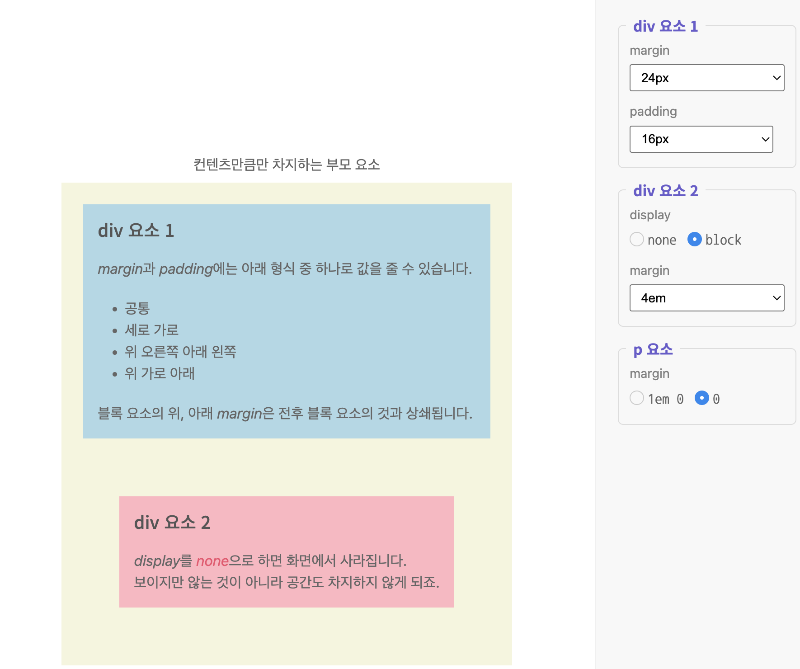

# 글자 스타일
## 기울임 / 굵기
기본 문법
```css
선택자 {
  속성1: 값;
  속성2: 값;
  ...
}
```
### font-style
1. italic : 글자를 기울인 서체로 쓴 것
2. oblique : 기존 글자에 각도를 넣어서 기울인 것
그래서 특정 서체는 italic만 있고 다른 서체는 oblique만 있는 등 둘 다 있는 경우도 있고 그냥 지 맘대로입니다.

### font-weight
굵기를 바꾸려면 font-weight 속성을 이용하는데, 원래 굵기를 위한 값은 normal, 굵게 하려면 bold를 사용합니다. 
마찬가지로 서체마다 normal / bold의 보유 여부가 다르고,
 심지어 100 ~ 900 사이의 숫자로 가중치를 두어서 굵게를 미세하게 조정하는 것도 가능합니다.

 * 참조
 HTML 태그를 통해서 서체 지정을 했는데 중복으로 CSS에서 해야만 하는가에 대한 의문이 생길 수 있습니다.
 CSS 자체는 스크린 리더가 되지 않는다, SEO에도 관여하지 않는다는 점 때문에,
 실제로 눈에 보이는 화면 상의 차이가 없다고 하더라도 HTML / CSS를 둘 다 신경 쓰는 편이 좋습니다.

## 글자 크기
 서체의 경우에는 페이지 상의 일관성을 위해서 고정을 시키지만
 하나의 서체라고 하더라도 어느 위계에 있는지에 따라 다양하게 표현될 수 있습니다.
 그런데 웹 상에서의 글자 크기는 고정된 크기의 종이에 인쇄하는 것이 아니고
 유동적으로 크기가 변하는 화면에서 사용하기 때문에 지정 방식과 크기를 표현하는 단위가 다양합니다.

### font-size
- CSS에서 가장 많이 작성하는 속성으로, 다양한 단위 사용.
  - 절대값 : 픽셀px / 포인트pt
  - 상대값 : 퍼센트% / em / rem
    - _부모 요소의 크기에 비례해서 나타남_
* 참조 사이트
https://showcases.yalco.kr/html-css/02-02/02.html

02_fontsize.html / 02_fontsize.css

그러면 확인했듯이 em의 경우 부모 자식 구조가 여러 단계로 중첩됐을 때 연쇄적으로 영향을 받기 떄문에 원하는 만큼 글씨 크기를 조절하는 것이 더 어려울 수 있습니다. 이 때 rem 단위를 사용하는데, 가장 상위 부모, 즉 _html 요소_ 를 기준으로 크기를 결정하는데, 중첩된 요소는 모두 동일한 크기가 적용됩니다.

pt의 경우는 웹사이트를 종이로 인쇄할 경우 결과물의 크기를 결정하는 단위에 해당합니다.
그래서 인쇄 상황이 아니면 잘 사용하지 않는 단위에 해당합니다.

## 글자 꾸미기
https://showcases.yalco.kr/html-css/02-02/03.html
https://developer.mozilla.org/ko/docs/Web/CSS/Reference/Properties/text-decoration

### text-decoration
- 글자를 다양하게 꾸며주는 속성으로 속성값을 여러개 지정할 수 있습니다.
- 종류
  1. underline : 밑줄
  2. line-through : 취소선
  3. overline : 윗줄
  4. wavy : 물결선
  5. dotted : 점선
  6. dashed : ---- 이런 게 폰트 위에 있습니다.
### text-tranform
- 영문 알파벳 대소문자 표시에 사용됨.
- 종류
  1. none : default 값 출력
  2. capitalize : 단어의 첫 알파벳만 대문자
  3. uppercase : 전체 대문자
  4 lowercase : 전체 소문자

  * 참조
  - 처음부터 대소문자를 구분해서 쓰면 안되는가의 문제가 있습니다. 저희가 HTML 문서를 작성할 때는 직접 통제해서 쓰기 때문에 이 부분에 대한 체크의 문제가 없지만 만약에 DB에서 받아오게 될 경우 특히 영어의 경우에 어떤 문자형태로 올지 모르기 때문에 보험용으로 작성해둡니다.

  03_textdecoration.html

### text-shadow
https://showcases.yalco.kr/html-css/02-02/04.html
  - 글자에 그림자를 주는 속성.
  - 형식 : X좌표 Y좌표 (흐림) 색 // 참고 (흐림)은 선택사항

  그림자가 상하좌우 등 여러 곳에 지정될 경우에는 쉼표(,)를 통해서 구분합니다.
  04_textshadow.html

# 문단과 목록 스타일
- 한정된 공간 상에서의 텍스트를 여러 줄로 나타내는 문단 / 목록 스타일을 CSS로 정의해볼겁니다.
https://showcases.yalco.kr/html-css/02-03/01.html

## 정렬과 간격
- 텍스트를 왼쪽, 오른쪽, 가운데로 정렬하거나 자간, 줄 높이, 들여쓰기 등을 지정하는 부분입니다.
### text-align
- 상자 스타일(div / p 태그 등)의 한정된 공간 안에 텍스트가 여러 줄 들어갈 때에는 text-align 속성을 이용해서 _텍스트 및 인라인 요소의 정렬 방식을 지정_
- 속성 값 종류
  1. left
  2. right
  3. center
  4. justify : 양쪽 정렬 - 마지막 줄을 제외하고 각 줄의 끝 부분이 고르게 떨어지도록 자동 조정

### letter-spacing / word-spacing
1. letter-spacing : (글)자간
2. word-spacing : 단어간 - 띄어쓰기 공백에 해당한다고 볼 수 있습니다.
  - 문단의 세부 요소 간격을 조절할 떄는 픽셀보다는 상대값인 em 태그를 쓰는 것을 추천합니다. 서체에 따라 글자 간격이 상대적으로 크거나 작게 조정되어있기 때문에 아까처럼 예시 보여줄 때 말고는 상대값으로 눈으로 보면서 조절하시는게 좋습니다. - 일관성 문제
  - px / em / rem / 음수값도 가능

### line-height
- 줄 높이 조절합니다. 일반적으로는 글자 크기의 1.5배, 즉 1.5em을 지정해줍니다.
05_textalign.html
* 참조 사이트
https://showcases.yalco.kr/html-css/02-03/02.html

### text-indent
https://showcases.yalco.kr/html-css/02-03/02.html

### 목록 스타일
https://showcases.yalco.kr/html-css/02-03/03.html
06_listclone.html / css 생성 위에 페이지에서 ul과 ol부분만 다 만드시오 css활용하여 4 다크피닉스 부분에 취소선 작성

다크 피닉스 부분에 취소선 작성하려면 기본적으로 line-throuth 속성을 지정해야하는데 그 방법이 다양

07_liststyle.html

# 인라인 / 블록 및 박스 모델 이해
ch06_inline_block_box 폴더
얘가 근데 CSS에서 어쩌면 제일 중요한 부분에 해당합니다.
인라인 요소 및 블록 요소는 웹 페이지의 공간을 구성하는 기본 방식에 해당합니다.

## 기본 너비와 개념
https://showcases.yalco.kr/html-css/02-05/01.html
어제 배웠던 대로라면 `<span>` vs. `<div>` 의 성격상의 차이로, span 태그는 내부 요소의 컨텐츠 길이만큼의 영역을 차지하고, div 태그는 컨텐츠 영역이 차지하는 행 전체 영역을 가진다고 했습니다.

그런데 그건 HTML 상에서의 태그 성격일 뿐이고, CSS로는 그것도 반전시킬 수 있습니다.
display 속성을 이용할 수 있습니다.

display 속성의 속성 값
  1. inline : 컨텐츠 길이의 영역만큼만 차지하게끔 설정
    - 너비를 인위적으로 설정하는 것이 불가능 -> 컨텐츠 길이의 영역만큼 너비가 정해지기 때문에
    - 높이도 인위적으로 설정하는 것이 불가능
  2. block : 컨텐츠 길이가 차지하는 행 전체 영역만큼 차지하게끔 설정
    - 너비 / 높이를 인위적으로 설정하는 것이 가능
  3. inline-block : 기본적으로 인라인 요소의 속성을 따릅니다(컨텐츠 길이의 영역만큼만 차지한다는 점에서). 그런데 인위적으로 너비와 높이를 설정 가능함.

## 너비와 높이 조절하기
- width : 너비 / 가로 길이
- height : 높이 / 세로 길이

## 여백 적용하기
- margin : 컨텐츠 영역의 바깥쪽 여백 - border를 기준으로 바깥쪽이기 때문에 컨텐츠 박스 자체가 시각적으로 커져보이즈는 않음.
papping : 컨텐츠 영역의 안쪽 여백 - border를 기준으로 안쪽이기 때문에 컨텐츠 박스 자체가 시각적으로 커져보입니다(근데 내부 컨텐츠 영역이 인위적으로 늘어나거나 하지는 않음).

01_inlineblock.html

# 박스 모델
## 요소의 크기
https://showcases.yalco.kr/html-css/02-06/01.html
요소의 크기라고 했으니까 기본적으로 display가 block이거나 inline-block일겁니다.
고정값 크기는 보통 px 이용할건데, 브라우저나 모니터 사이즈나 혹은 모바일이냐에 따라서 달라지기 때문에 px를 사용하면 불편하게 됩니다.

이때 상대값으로 퍼센트(%)를 사용하면 부모 크기에 비례한 길이가 됩니다.
02_divbox.html
디바이스에 따라 유동적으로 크기를 조절할 때 유용한 기능이 뷰포트(viewport)입니다. 실제 창(브라우저)의 크기라고 생각할 수 있습니다.
뷰포트를 이용한 단위가
- vw(viewport width) : 뷰포트를 기준으로 가로 길이 1 ~ 100까지 있습니다 (%)
- vh(viewport height) : 뷰포트를 기준으로 세로 길이 1 ~ 100까지 있습니다
- vmax(viewport maximum) : 상대적으로 길이가 긴 쪽을 의미함.
- vmin(viewport minimum) : 상대적으로 길이가 짧은 쪽을 의미함.
  - vmax / vmin의 경우 어떤 디바이스를 쓰는가에 따라 다른데 일반적인 PC / laptop의 경우 vmax는 가로길이겠지만 모바일 폰의 경우에는 세로길이에 해당한다는 차이점이 있습니다.

vw / vh의 경우는 텍스트 크기를 설정하는 데에도 쓸 수 있습니다. 예를 들어서 font-size 속성을 10vmin으로 지정한다면 어떤 화면에서 길이가 짧은 쪽의 1/10 정도이 크기를 설정한다고 할 수 있습니다.

이상과 같이 화면 크기에 따라 텍스트의 크기가 동적으로 변해야할 때는 font-size를 v 단위를 사용하는 방법도 있습니다.

텍스트를 영역의 중간에 위치시키는 방법
```css
div {
  background-color: darkcyan;
  text-align: center;
  height: 100vh;
  line-height: 100vh;
  /* height와 line-height를 동일한 값을 주게 되면 `텍스트가 한 줄 일 경우 `중간에 위치시킬 수 있습니다. */
}
```

또 다른 크기를 조절하는 방법은 복잡한 계산을 컴퓨터에게 넘기는 방식입니다. 매개변수를 이용해 css에서 특정한 수치를 계산해주는 함수인 calc()를 이용합니다.

예를 들어 calc(100% + 100px)이라고 하면 상대값 100%의 수치에 100px 더 큰 값을 나타내도록합니다.
그래서 절대값 뿐만 아니라 상대값, 그리고 vw, vh 등을 매개변수로 사용할 수 있습니다.

## 바깥쪽 여백과 안쪽 여백(margin vs. padding)
https://showcases.yalco.kr/html-css/02-06/02.html

### margin & padding
  1. margin 값을 하나로 지정하는 경우 : 상하좌우 모든 방향에 마진 적용
  2. 두 개로 지정하는 경우 : 상하 / 좌우
  3. 네 개로 지정하는 경우 : 상우하좌 순서대로 적용됨(12시부터 시계방향으로)
  4. 세 개로 지정하는 경우 : 상 / 좌우 / 하 로 적용됨.

  근데 margin-top / padding-bottom 등 하나하나를 속성으로 지정해줄 수도 있습니다.

  * 주의 사항
  블록 요소의 위 / 아래 margin은 전후 블록(웬만하면 div 태그겠죠) 요소의 것과 상쇄된다는 특징이 있습니다. 그런데 문제는 웬만하면 전후의 상하 margin이 동일한 값이면 별로 상관이 없는데 혹시나 div-1의 margin 상하가 30px이고, div-2의 margin 상하가 60px이면, 30px은 무시되고 60px로 결정나게 됩니다.

  블록 요소의 위, 아래 margin은 전후 블록 요소의 것과 상쇄됩니다.

  

  이상의 이미지에서 div요소 2의 경우 4em으로 잡혀서 div요소 1보다 더 넓은 상하 마진을 가지기 때문에 div1과 div2의 마진 영역이 4em으로 결정되었습니다.

03_marginpadding.html

혹시나 여러분이 직접 지정하지 않은 여백이 있는 경우(특히 live server를 켰을 때)는 브라우저 자체에서 여백을 지원하기 때문입니다.

개발자 도구 상에서 margin=0로 고쳐주면 좀 더 여러분이 의도한 화면이 나오게 됩니다.

근데 그게 귀찮다 하면 css 파일에 미리 cssreset 코드를 입력해두고 시작하는 방법이 있습니다.
```css
/* http://meyerweb.com/eric/tools/css/reset/ 
   v2.0 | 20110126
   License: none (public domain)
*/

html, body, div, span, applet, object, iframe,
h1, h2, h3, h4, h5, h6, p, blockquote, pre,
a, abbr, acronym, address, big, cite, code,
del, dfn, em, img, ins, kbd, q, s, samp,
small, strike, strong, sub, sup, tt, var,
b, u, i, center,
dl, dt, dd, ol, ul, li,
fieldset, form, label, legend,
table, caption, tbody, tfoot, thead, tr, th, td,
article, aside, canvas, details, embed, 
figure, figcaption, footer, header, hgroup, 
menu, nav, output, ruby, section, summary,
time, mark, audio, video {
	margin: 0;
	padding: 0;
	border: 0;
	font-size: 100%;
	font: inherit;
	vertical-align: baseline;
}
/* HTML5 display-role reset for older browsers */
article, aside, details, figcaption, figure, 
footer, header, hgroup, menu, nav, section {
	display: block;
}
body {
	line-height: 1;
}
ol, ul {
	list-style: none;
}
blockquote, q {
	quotes: none;
}
blockquote:before, blockquote:after,
q:before, q:after {
	content: '';
	content: none;
}
table {
	border-collapse: collapse;
	border-spacing: 0;
}
```

04_marginauto.html

- auto
  - 여백 설정에서 중요한 팁은 auto 값입니다. _너비(가로길이)가 지정된 블록 요소의 가로 방향에서 남은 공간을 자동으로 채우는 방식_ (상하로는 적용이 되지 않습니다.)

  - auto 속성 자체의 너비 정렬은 여전히 많이 쓰이기는 하지만 추후 학습할 flex 개념으로 많이 대체되었습니다.

```html
<!DOCTYPE html>
<html lang="ko">
<head>
  <meta charset="UTF-8">
  <meta name="viewport" content="width=device-width, initial-scale=1.0">
  <title>Document</title>
  <link rel="stylesheet" href="./04_marginauto.css">
</head>
<body bgcolor="5f5f5f">
  <div></div>
  <p>지금부터 <span>이 부분에 관련된 부분을 처리하겠습니다.</span></p>
  <p>여기는 span 태그가 없습니다.
    <div>여기에 뭔가 썼다고 칩시다. 태그 내부에 있는데 text-align이 적용안되고 왼쪽에 쓰이고 있죠.</div>
  </p>
</body>
</html>
```

```css
/* body {
  text-align: center;
} */

div {
  display: inline-block;
  /* inline-block으로 display를 설정하게 되는 경우 width / height의 지정은 가능하나 margin에서 auto가 먹지 않습니다. 가로세로 지정은 block의 성격이지만 margin auto가 안먹히는 것은 inline부분의 성격이라고 할 수 있겠습니다. */
  background-color: orangered;
  width: 200px;
  height: 200px;
  margin: 0 auto;
}
/* 
왜 이상과 같이 했을 경우에만 작동 되냐면 인락은 블록 요소가 지금 박스 모습으로 보이기는 하지만 기본적으로 **텍스트의 흐름**을 따라가기 때문에 부모 요소에서 text-align 속성을 지정해줘야지 block 요소처럼 margin으로 조정이되지 않기 때문입니다.

display: block;의 경우에는 너비와 높이를 지정할 수 있지만 기본적으로 전체 row를 다 잡아먹는 구조입니다. 그렇기 때문에 margin을 통해서 통제가 가능하지만 부모 요소에서 `text`로 조절할 수 없습니다.
*/

p{
  text-align: end;
}
```

## 테두리 속성

05_border.html

요소의 바깥쪽 테두리를 그리게 되면 해당 요소를 강조하거나 명확화할 수 있습니다. 특히 테두리 바깥쪽은 margin이고 테두리 안쪽이 padding이라는 점에서 학습할 때도 도움이 됩니다.

### border 속성
특정 요소의 테두리 모양을 설정하는 CSS. 속성을 지정할 때는 테두리 선의 굵기와 스타일, 색상을 순서대로 지정하면 됩니다.
형식
```
border: 선굵기 스타일 색상
```

https://showcases.yalco.kr/html-css/02-07/01.html

내일 수업 예정 부분 box-sizing / box-radius부터 시작

### 중간 위치 관련 코드
```html
<!DOCTYPE html>
<html lang="ko">
<head>
  <meta charset="UTF-8">
  <meta name="viewport" content="width=device-width, initial-scale=1.0">
  <title>Document</title>
  <style>
    body {
      margin: 0;
    }
    div {
      width: 300px;
      height: 80px;
      line-height: 80px;
      text-align: center;
      position: fixed;
      top: calc(50% - 40px);
      left: calc(50% - 150px);
      background-color: aqua;
    }
  </style>
</head>
<body>
  <div>해당 요소를 화면 가운데에 배치하겠습니다</div>
</body>
</html>
```

# flex 레이아웃
- 모든 웹사이트는 큰 레이아웃 형태의 구조로 되어있고, 만드는 방식도 다양합니다. 예전에는 inline / block / inline-block을 통해서 하나하나 위치를 지정해주는 작업을 많이 했었는데, flex 레이아웃 적용 이후에는 CSS 코드 작성 메커니즘이 좀 바뀌었습니다.

https://showcases.yalco.kr/html-css/02-11/01.html

## 부모에 적용하는 flex
- flex 레이아웃의 경우 부모 요소에 적용하는 속성과 자식 요소에 적용하는 속성으로 구분됩니다.
- 이상의 사이트를 기준으로 설명합니다.
  - display: block; 의 경우 default 값으로 볼 수 있습니다.
  - display: flex; 를 적용했을 경우 보라색 div들이 수평 배치되는 것을 확인할 수 있습니다.
  - display: inline-flex;로 지정했을 경우, 회색 div 부분이 inline-block으로 바뀌면서 자식 요소들은 flex와 동일한 방식으로 배치합니다.
- display 값의 조정은 해당 부모 요소를 inline으로 만드는 것이 flex / inline-flex의 차이점이 됩니다.

- 그래서 이하에서 설명하는 내용들은 display: flex / inline-flex를 기준으로 설명하게 됩니다.
### flex-direction
- 내부 자식 요소들을 어느 축을 기준으로 정렬할지 결정함. default 값은 row
- 그래서 display: flex / flex-direction: row 일 경우 자식 요소들을 row 방향으로 배치합니다.
- 그렇다면 flex-direction: row-reverse의 경우 자식 요소의 순서를 반대의 row방향으로 배치합니다.

- column도 동일한 방식으로 작동합니다.
- flex-direction의 속성값(즉 축의 방향)에 따라 justify-content / align-items / align-content 등의 속성이 작동하는 방향이 결정됩니다.
- display:flex; 를 적용하는 순간 순차적으로 다음 속성의 속성값들을 고려할 필요가 있습니다.

### justify-content
- 메인 축에서 내부 요소를 정렬하는 방식을 결정.
- display: flex를 적용했기 때문에 -> flex-direction: row로 정했으면 -> justify-content: flex-start로 잡았다고 가정했을 떄, 그러면 자식 요소들이 row로 정렬되는데, 시작점부터니까 왼쪽부터 정렬된 것이다 라고 추측할 수 있다.
- space-between : 내부 양쪽 요소의 처음과 시작 부분에 배치하고, 가운데에 빈 공간을 알아서 채워넣습니다.
- space-around : 내부 요소의 양쪽에 일정한 크기의 빈 공간을 두고 배치
- space-evenly : 모든 빈 공간의 크기를 일치시킴.

### align-items
- flex의 마이너 축(flex-direction이 row면 column을 의미함)에서 내부 요소를 정렬할 방식을 결정하는 속성.
- default 값으로 stretch가 적용되어있습니다. 즉 flex-direction: row이고, align-items가 stretch라면 마이너 축이 column이니까 column 방향으로 stretch(쭉 뻗어나감)된다는 것으로 해석할 수 있습니다.

- 그러면 이상까지 왔을 때 flex의 default 형태가 왜 123 div들이 세로로 길어졌는지 이해할 수 있겠네요.

- align-items : flex-start로 지정하면 수직 축의 시작부분, 즉, y축 상단으로 내부 요소를 갖다 붙이게 됩니다.
- align-items : center 중앙 정렬
- align-items : flex-end 하면 y축 하단부터 시작하겠네요.
- 그런데 stretch 제외 나머지가 48px * 48px 인 이유는 참조사이트의 설정 때문에 그렇습니다.

### flex-wrap
- 자식 요소가 부모의 요소의 영역을 넘어갈 정도로 많을 경우에 하는 배치 방법입니다.
- flex-wrap: wrap으로 하면 내부 요소가 부모 요소를 넘어가지 않도록 _자동으로_ 배치해줍니다. 주로 컨텐츠가 한 줄이 아니라 여러 줄일 때 적용합니다.
### align-content
- display:flex / flex-direction: row / justify-content: flex-start / align-items: flex-start / flex-wrap: wrap이라면 내부 요소에 공백이 다양한 방식으로 생겼습니다. 예를 들면 이상의 속성값인 경우에 오른쪽 부분에 공백이 생기겠네요.
- 이상의 속성값을 유지한 상태에서 align-content를 flext-start / center / flex-end로 바꿨을 경우에는 내부 요소가 전체가 공백 _없이_ 위, 가운데, 아래쪽으로 붙는다는 점을 알 수 있습니다.
- 그러면 얘가 align-items랑 관련있겠네 싶겠지만 또 헷갈리게 justify-content처럼 space-between / around / evenly처럼 간격 조절을 할 수 있는 방법이 따로 있습니다.

실제 실무까지 갔을 때 align-content까지 적용하는 사례가 그렇게 많지는 않습니다.

### gap
- 내부 요소들 사이에 들어가는 공백의 크기를 지정하는 속성, em 단위 사용 / 두 개의 값을 지정해서 가로 공백 / 세로 공백으 별개로 지정할 수도 있음.

## 자식에 적용하는 flex
https://showcases.yalco.kr/html-css/02-11/02.html

### flex-basis / flex-shrink
1. flex-basis : 메인 축의 길이를 지정함. - 중요한 것은 부모 요소가 display: flex;가 정해져있는 상태라면 자식 요소들의 너비 / 높이가 고정되는 경향이 있는데, 특정한 자식 요소이 너비 / 높이를 임의적으로 정할 수 있다는 점에서 가치가 있습니다. / default 값은 auto
2. flex-shrink : 전체 공간이 부족할 경우(즉 부모 요소이 크기가 고정되어있는 경우) 해당 내부 요소의 크기가 컨텐츠의 너비 또는 flex-basis로 지정한 값보다 알아서 작게 고정될 수 있도록 조절하는 속성. default 값은 1 // 0 으로 입력하면 부모 요소의 영역 바깥으로 빠져나갑니다.
  - flex-shrink가 1인 상태에서 자식 요소들이 부모 요소의 크기보다 커지려고 하면 마이너 축 방향으로 늘어납니다.
  ### flex-grow
  - 내부 요소에 빈 공간이 있을 경우에 그 공간을 채울지의 여부를 결정하고, 채울 경우에는 자식 요솓ㄹ끼리의 flex-grow의 값에 따라 비례적으로 부모 영역을 분할하게 됩니다.

### order 속성
https://showcases.yalco.kr/html-css/02-11/04.html
들어가서 건드려보면 html 태그 순서와 ux의 순서를 다르게 조작할 수 있는 CSS입니다.

# 요소를 감추는 방법
https://showcases.yalco.kr/html-css/02-10/02.html
## 3 가지 방법
### # 1 opacity 적용 방법
- 요소의 불투명도를 조절하는 속성으로 0 ~ 1까지의 값을 가집니다. 근데 안보이는거지 사라진게 아니기 때문에 기능이 동작합니다.
### # 2 visibility
- 속성값
  1. visible
    - default
  2. hidden
    - 안보이고 기능도 전부 사라집니다.
    - 그런데 공백은 존재함.
### # 3 display: none 활용
  - 기존 요소가 차지하고 있던 자리까지 전부 다 날립니다.
  
03_cursor.html

# 내일 수업 예정 부분
